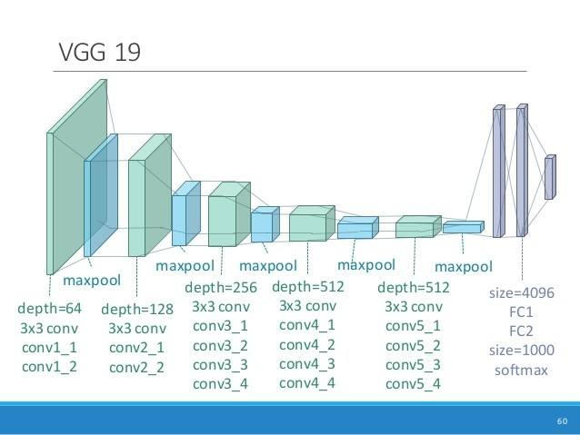
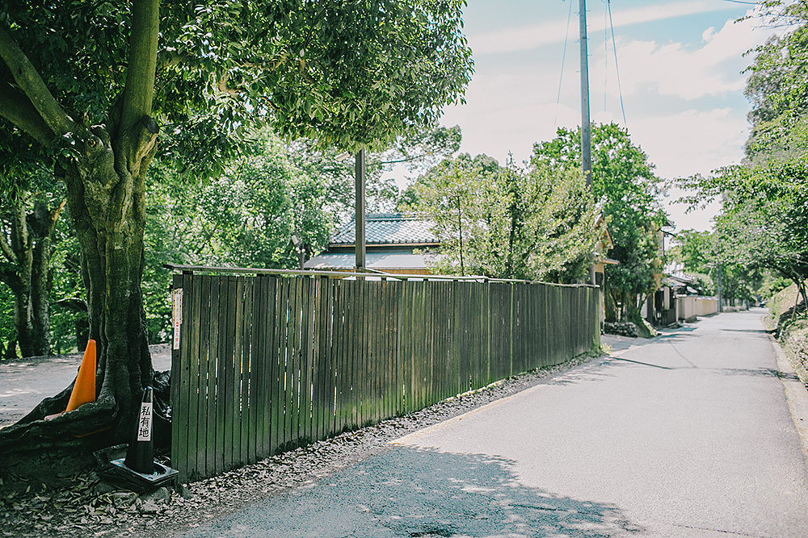
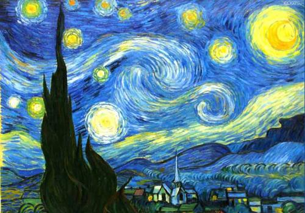
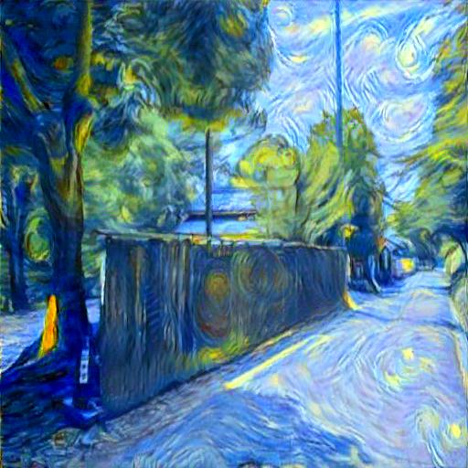

### <center>**$PyTorch$实现风格迁移**

#### 一、模型建立

使用$PyTorch$基于$ImageNet$数据集预训练的 **$VGG-19$** 模型来抽取图像特征

```python
import torchvision.models as model
vgg = model.vgg19(pretrained=True).features
```

**$VGG-19$** 模型的结构如下：



由于我们只提取特征，后面的$FC$层就不必考虑了，根据书里的说法：

>一般来说，越靠近输入层的输出越容易抽取图像的细节信息，反之则越容易抽取图像的全局信息。

所以我们选择较靠近输出的层作为**内容层**，另外选择不同卷积块中的输出来匹配局部和全局的样式，作为**样式层**。

```python
style_layers, content_layers = [0, 5, 10, 19, 28], [25]
```

上述代码中的具体层数可以通过打印 **$VGG-19$** 模型的结构来获取

```python
for idx, i in enumerate(vgg) :
    print(idx, i)
```

#### 二、损失函数

损失函数包含三个部分：

* $1.$ 内容损失函数

    与线性回归中的损失函数类似，我们使用平方差损失函数衡量合成图像与内容图像在内容特征上的差异：

    ```python
    ## ------------------- content loss function ------------------ ##
    class ContentLoss(nn.Module) :

        def __init__(self, target, weight):
            super(ContentLoss, self).__init__()
            self.target = target.detach()
            self.weight = weight
            self.criterion = nn.MSELoss()

        def forward(self, inputs) :
            self.loss = self.weight * self.criterion(inputs, self.target)
            outputs = inputs.clone()
            return outputs
    ```

* $2.$ 风格损失函数

    首先需要了解一个叫做 **格拉姆矩阵($Gram\quad matrix$)** 的东西，我们知道，每一个样式层输出的是一个$C × M × N$的特征图，其中$C$是通道数，那么对于此特征图的格拉姆矩阵有如下的定义：

    $$
    Gram_{i, j} = \sum_{p=0}^M\sum_{q=0}^Nfeatures[i, p, q] * features[j, p, q]
    $$

    这样格拉姆矩阵中每个元素都可以表示两层特征图的一种组合，就可以定义为它的风格。然后风格损失就可以定义为两个格拉姆矩阵的平方差损失：

    ```python
    ## ------------------- gram matix function ------------------ ##
    class Gram(nn.Module) :

        def __init__(self):
            super(Gram, self).__init__()

        def forward(self, inputs) :
            batch_size, channels, width, height = inputs.size()
            features = inputs.view(batch_size * channels, width * height)
            return torch.mm(features, features.t()) / (batch_size * channels * width * height)

    ## ------------------- style loss function ------------------ ##
    class StyleLoss(nn.Module) :

        def __init__(self, target, weight):
            super(StyleLoss, self).__init__()
            self.target = target.detach()
            self.weight = weight
            self.gram = Gram()
            self.criterion = nn.MSELoss()

        def forward(self, inputs) :
            gram_features = self.gram(inputs)
            self.loss = self.weight * self.criterion(gram_features, self.target)
            outputs = inputs.clone()
            return outputs
    ```

    这里为了避免格拉姆矩阵的元素太大，我们把矩阵整体除以矩阵的元素个数，即：$(C × M × N)$

* $3.$ 总变差损失函数

    有时，我们合成的图像里有大量高频噪点，极大的影响美观。为了较低噪声带来的影响，我们采用一种**总变差降噪(total variation denoising)** 的方法来降噪，假设$x_{i,j}$表示坐标为$(i, j)$的像素值，总变差损失定义为：

    $$
    TVD\_Loss = \sum_{i, j}|x_{i,j} - x_{i+1, j}| + |x_{i,j} - x_{i, j + 1}|
    $$

    ```python
    ## ------------------- total variation denoising loss function ------------------ ##
    class TotalVariationDenoisingLoss(nn.Module) :

        def __init__(self, weight):
            super(TotalVariationDenoisingLoss, self).__init__()
            self.weight = weight

        def forward(self, inputs):
            self.loss = self.weight * 0.5 * ((inputs[:, :, 1:, :] - inputs[:, :, :-1, :]).abs().mean() +
                            (inputs[:, :, :, 1:] - inputs[:, :, :, :-1]).abs().mean())
            outputs = inputs.clone()
            return outputs
    ```

#### 三、图像处理

* $1.$ 内容图片与风格图片的处理


    <center class="half">
       
    </center>

    对内容图片和风格图片进行标准化处理，再转换成$Tensor$类型：

    ```python
    mean = [0.485, 0.456, 0.406]
    std = [0.229, 0.224, 0.225]

    img_transforms = transforms.Compose([
        transforms.Resize((512, 512)),
        transforms.ToTensor(),
        transforms.Normalize(mean, std)
    ])

    BASE_DIR = os.path.dirname(os.path.abspath(__file__))

    ## ------------------- load content, style image ------------------ ##
    def load_image(img_path) :
        img = Image.open(img_path).convert('RGB')
        img = img_transforms(img)
        img = img.unsqueeze(0)
        return img
    ```

    对于网络输出的生成图像，进行逆标准化处理，再进行保存

    ```python
    def save_image(img) :
        img = img.squeeze(0)
        t_mean = torch.as_tensor(mean, dtype=img.dtype, device=img.device)
        t_std = torch.as_tensor(std, dtype=img.dtype, device=img.device)
        img = img * t_std[:, None, None] + t_mean[:, None, None]
        img = transforms.ToPILImage()(img)
        img.save(BASE_DIR + "/g_image.jpg")
    ```

* $2.$ 生成图片的处理

    生成图像是唯一需要更新的参数，因此我们定义一个模型用来初始化一张随机的图像，同时也是该模型的唯一参数，前向计算时，只需要返回该图像即可：

    ```python
    ## ------------------- generated function ------------------ ##
    class GeneratedImage(nn.Module) :

        def __init__(self) :
            super(GeneratedImage, self).__init__()
            self.parmas = nn.Parameter(torch.randn(1, 3, 512, 512), requires_grad=True)
            self.init()
            self.parmas.requires_grad_()

        def init(self) :
            for weight in self.parmas :
                nn.init.normal_(weight, 0., 1.)

        def forward(self) :
            return self.parmas
    ```

#### 四、训练

使用`torch.optim`中的`LBFGS`优化器训练$500$个$epochs$，结果如下：

<center>
    
</center>

